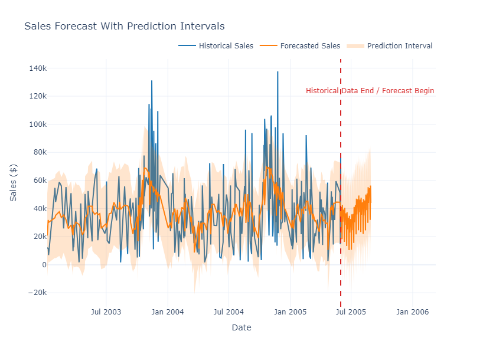
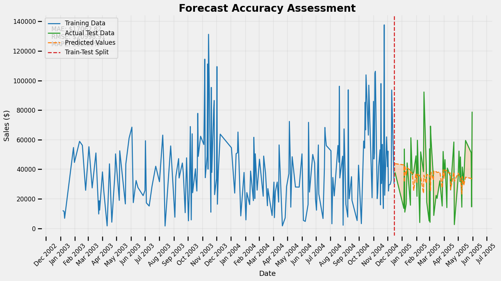
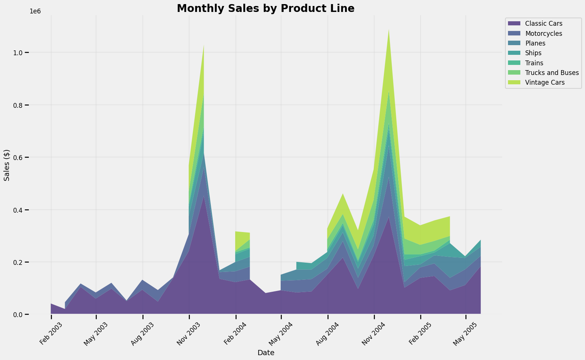
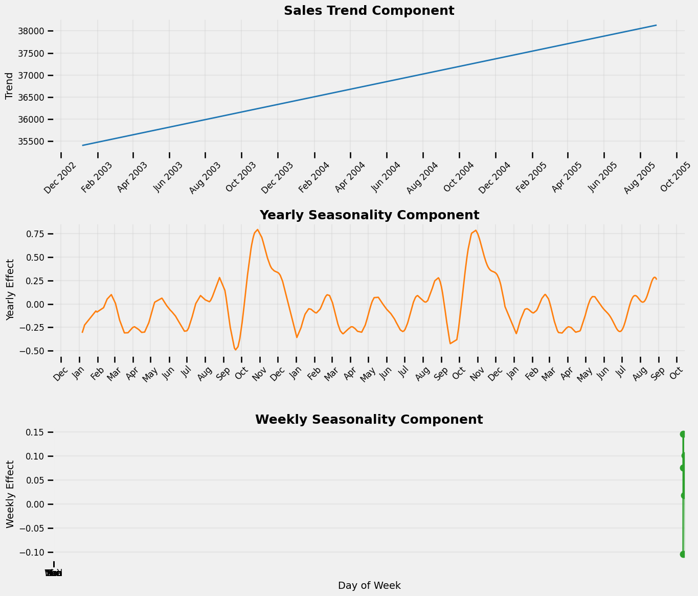
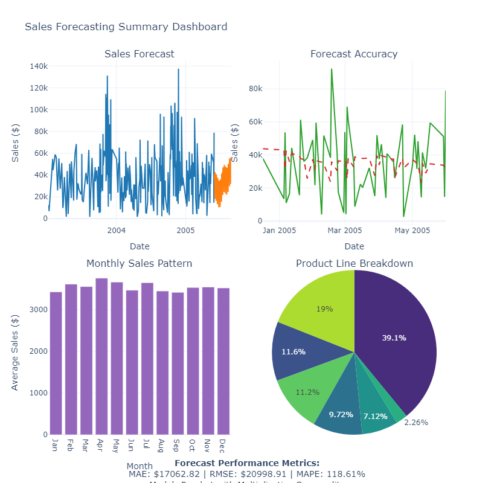

# Sales Forecasting for Retail Business

## Future Internship Company - ML Task 01

### Project Overview
This project implements time series forecasting for a retail business to predict future sales trends. The model incorporates seasonality analysis and provides visualizations of forecast accuracy.

### Skills Applied
- Time series forecasting
- Regression analysis
- Trend analysis
- Data visualization

### Tools Used
- Python (Prophet, Scikit-learn, Pandas)
- Matplotlib & Plotly for visualization
- Seaborn for enhanced visualizations

### Dataset
Sales data from a retail business containing transaction information such as order dates, product lines, and sales figures.
- Dataset source: [Sample Sales Data (Kaggle)](https://www.kaggle.com/datasets/kyanyoga/sample-sales-data)

### Implementation Details
1. Data preprocessing and exploration
2. Time series decomposition to identify trends and seasonality
3. Prophet model implementation with multiplicative seasonality
4. Model evaluation using MAE, RMSE, and MAPE metrics
5. Creation of interactive visualizations for forecast and accuracy assessment
6. Business insights extraction

### Key Findings
- Model trained on 201 days of historical sales data
- Sales forecast generated for next 90 days
- Forecast accuracy (MAPE): 118.62%
- Top performing product line: Classic Cars ($3,919,615.66)
- Day with highest average sales: Tuesday
- Projected growth trend: 20.62% over next quarter

### Visualizations

### Future Improvements
- Incorporate external factors like promotions and holidays
- Experiment with different forecasting algorithms (ARIMA, LSTM)
- Implement anomaly detection for unusual sales patterns
